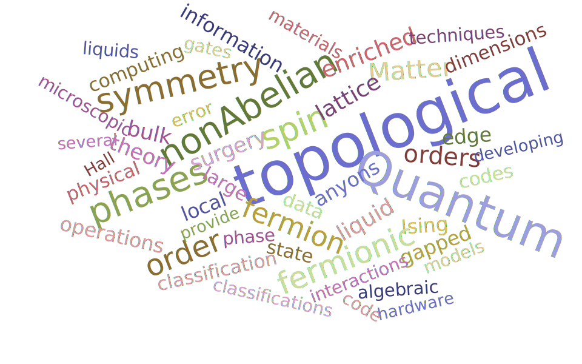

## Research interests:
The interplay of topology, quantum information, and condensed matter physics has emerged as one of the most fascinating and quickly developing areas of modern research. 
In Philip Anderson's famous 1972 article ["More is Different,"](https://science.sciencemag.org/content/177/4047/393) he describes how the collective behavior of large complex aggregates can drastically differ from that of the constituents. 
Typically these macroscopic behaviors are distinguished by local symmetry breaking order parameters.
A famous counterexample came with the discovery of the quantum Hall effect, where distinct phases enjoyed the same symmetries and thus could not be fully charecterized by local order parameters alone.
This discovery marked the introduction of topological phases of matter and triggered decades of research on the subject.
Topological phases provide an organizing framework for a wide variety of problems from the quantum Hall effect to error-correcting codes.

Inherently robust to local perturbations, topological phases furnish platforms well-suited for fault-tolerant quantum computation.
Quantum computers are one of the major driving forces of research on topological phases today and promise a wide range of applications from testing modern security protocols to quantum simulators that can predict the physics of real systems beyond the capabilities of any classical computer.
Realizing this potential is burdened by many fundamental challenges such as environmental noise.
One resolution exploited in nearly all quantum computing platforms is the use of topology---at its core, one delocalizes quantum information over space, ensuring that it is insensitive to local perturbations.

Inspired by the need for realistic blueprints of quantum computing hardware, my research spans several areas of topological quantum condensed matter physics. On the practical side, I propose realizations of topological phases and highlight their applications toward quantum computing technologies. And on the more formal end, I characterize and classify topological phases by developing the fundamental mathematics underpinning their description. The wordcloud below gives a general sense of my interests.

## Papers on the arxiv:

1. David Aasen, Parsa Bonderson, Christina Knapp. Characterization and Classification of Fermionic Symmetry Enriched Topological Phases. [arXiv:2109.10911
](https://arxiv.org/abs/2109.10911)

1. Kevin Slagle, David Aasen, Hannes Pichler, Roger S. K. Mong, Paul Fendley, Xie Chen, Manuel Endres, Jason Alicea. Microscopic characterization of Ising conformal field theory in Rydberg chains. [arXiv:2108.09309](https://arxiv.org/abs/2108.09309)

1. David Aasen, Parsa Bonderson, Christina Knapp.Torsorial actions on G-crossed braided tensor categories. [arXiv:2107.10270](https://arxiv.org/abs/2107.10270)

1. Kai Klocke, David Aasen, Roger S. K. Mong, Eugene A. Demler, Jason Alicea. Time-domain anyon interferometry in Kitaev honeycomb spin liquids and beyond. [arXiv:2011.00015](https://arxiv.org/abs/2011.00015)

1. David Aasen, Paul Fendley, Roger S. K. Mong. Topological Defects on the Lattice: Dualities and Degeneracies. [arXiv:2008.08598](https://arxiv.org/abs/2008.08598)

1. David Aasen, Daniel Bulmash, Abhinav Prem, Kevin Slagle, Dominic J. Williamson. Topological Defect Networks for Fractons of all Types. [arXiv:2002.05166](https://arxiv.org/abs/2002.05166)

1. David Aasen, Roger S. K. Mong, Benjamin Hunt, David Mandrus, Jason Alicea. Electrical probes of the non- Abelian spin liquid in Kitaev materials. [arXiv:2002.01944](https://arxiv.org/abs/2002.01944)

1. Kevin Slagle, David Aasen, Dominic Williamson. Foliated Field Theory and String-Membrane-Net Condensation Picture of Fracton Order. [arXiv:1812.01613](https://arxiv.org/abs/1812.01613)

1. David Aasen, Ethan Lake, Kevin Walker. Fermion condensation and super pivotal categories. [arXiv:1709.01941](https://arxiv.org/abs/1709.01941)

1. David Aasen, Shu-Ping Lee, Torsten Karzig, Jason Alicea. Interaction effects in superconductor/quantum spin Hall devices: universal transport signatures and fractional Coulomb blockade. [arXiv:1606.09255](https://arxiv.org/abs/1606.09255)

1. Ryan V. Mishmash, David Aasen, Andrew P. Higginbotham, Jason Alicea. Approaching a topological phase transition in Majorana nanowires. [arXiv:1601.07908](https://arxiv.org/abs/1601.07908)

1. David Aasen, Roger S. K. Mong, Paul Fendley. Topological Defects on the Lattice I: The Ising model. [arXiv:1601.07185](https://arxiv.org/abs/1601.07185)

1. David Aasen, Michael Hell, Ryan V. Mishmash, Andrew Higginbotham, Jeroen Danon, Martin Leijnse, Thomas S. Jespersen, Joshua A. Folk, Charles M. Marcus, Karsten Flensberg, Jason Alicea. Milestones toward Majorana-based quantum computing. [	arXiv:1511.05153](https://arxiv.org/abs/1511.05153)

1. David Aasen, Tejal Bhamre, Achim Kempf. Shape from sound: toward new tools for quantum gravity. [arXiv:1212.5297](https://arxiv.org/abs/1212.5297)

1. Eduardo Martin-Martinez, David Aasen, Achim Kempf. Processing quantum information with relativistic motion of atoms. [	arXiv:1209.4948](https://arxiv.org/abs/1209.4948)

1. David Aasen, Stefano Chesi, W. A. Coish. Quasiparticle velocities in 2D electron/hole liquids with spin-orbit coupling. [	arXiv:1110.6661](https://arxiv.org/abs/1110.6661)

[comment]: ## Google [Scholar](https://scholar.google.com/citations?user=vNuuzc8AAAAJ&hl=en) page 

[comment]: [Link to CV (up-to-date Feb 2020)](./CV.html).

[comment]: <> ( [Link to another page](./another-page.html). ) 

